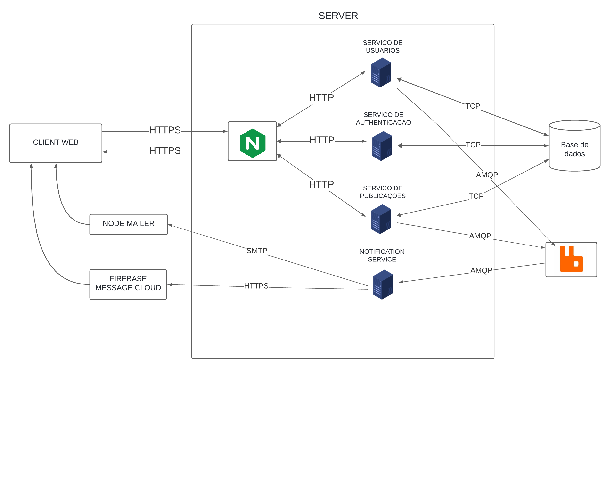

# Carolina News

Aplicação web com intuito de permitir aos usuários publicar notícias no formato texto. Para isso, utilizamos arquitetura de microserviços e fila de mensagens.

## Sumário

-   [Tecnologias utilizadas](#tecnologias-utilizadas)
-   [Dependências](#dependencias)
-   [Como executar](#como-executar)
-   [Colaboradores](#colaboradores)

## Tecnologias utilizadas

-   [NestJS](https://nestjs.com/) framework
-   [RabbitMQ](https://www.rabbitmq.com/) message broker
-   [ReactJS](https://react.dev/)
-   [PostgreSQL](https://www.postgresql.org/) banco de dados
-   [Docker](https://www.docker.com/) container e [Docker Compose](https://docs.docker.com/compose/)

## Arquitetura

As descrições dos componentes arquiteturais do sistema, os principais fluxos da aplicação e as definições das interfaces de serviço podem ser encontrados [aqui](https://github.com/DiogoRodriguees/sd-projeto-final/blob/main/Descri%C3%A7%C3%A3o%20Arquitetural.pdf).

## Dependências

-   [NodeJS](https://nodejs.org/en) v22.2.0
-   [Docker](https://docs.docker.com/engine/install/) v27.1.1
-   [Yarn](https://classic.yarnpkg.com/lang/en/docs/install/#debian-stable) v1.22.22

## Como executar

Você pode optar pode executar cada parte do sistema [individualmente](#executando-cada-serviço-individualmente) ou utilizando [docker compose](#executando-com-docker-compose). Lembre-se de alterar as variáveis de ambiente de acordo com a meneira que escolher.

### Executando cada serviço individualmente

Os links abaixo mostram como executar cada parte do sistema individualmente.

-   [Banco de dados](./servidores/database/readme.md)
-   [RabbitMQ](./servidores/rabbitmq/readme.md)
-   [Serviço de usuários](./users/README.md)
-   [Serviço de autenticação](./authorization/README.md)
-   [Serviço de publicações](./publications//README.md)

### Executando com Docker Compose

Abra o terminal na raiz do projeto onde o arquivo [docker-compose.yaml](./docker-compose.yaml) está e execute o comando `docker compose up`.

## Colaboradores

-   [Christofer Daniel Rodrigues Santos](https://github.com/ChristoferLv)
-   [Diogo Rodrigues Dos Santos](https://github.com/DiogoRodriguees)
-   [Gustavo Zanzin Guerreiro Martins](https://github.com/gustavomartinx)
